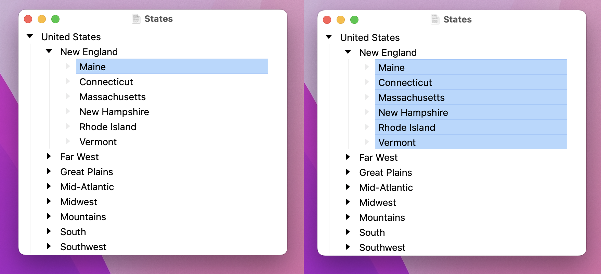

# Outline Editing

In addition to [Text Editing](text-editing.md) Bike supports outline editing mode. When in outline editing mode items are block selected as shown in the images above.

#### To enter and exit outline editing mode

* Press the `Escape` key to enter outline editing
* Press the `Escape` key again to exit outline editing mode
* Or Click to make a selection with your mouse to exit outline editing mode
* Or press `Return` to create a new item and exit outline editing mode.
* ...lots of ways out, use the `Escape` to enter!

### Outline Editing Commands

In Outline Editing mode the arrow keys have different behavior:

* `Left` Key\
  Collapse expanded items
* `Right` Key\
  Expand collapsed items
* `Up` Key\
  Move up by item
* `Down` Key\
  Move down by item

The item commands described in the [Text Editing](text-editing.md) section work differently too. They work on branches, not individual items. Movements are also restricted to the outline structure.

* Item > Duplicate (`Command-D`)
* Item > Indent (`Control-Command-Right`)
* Item > Outdent (`Control-Command-Left`)
* Item > Move Up (`Control-Command-Up`)
* Item > Move Down (`Control-Command-Down`)

Give it a try. Create a small outline and then try the above commands. First in text editing mode, second in outline editing mode. You'll soon see and understand the differences. Outline Editing mode can save a lot of time.

### More Outline Editing Commands

Some command work the same in both modes:

* Item > Insert Item (`Command-Return`)\
  Insert a new item
* Item > Group (`Option-Command-G`)\
  Inserts a new item above the selection. And then move the selection into that new item.
