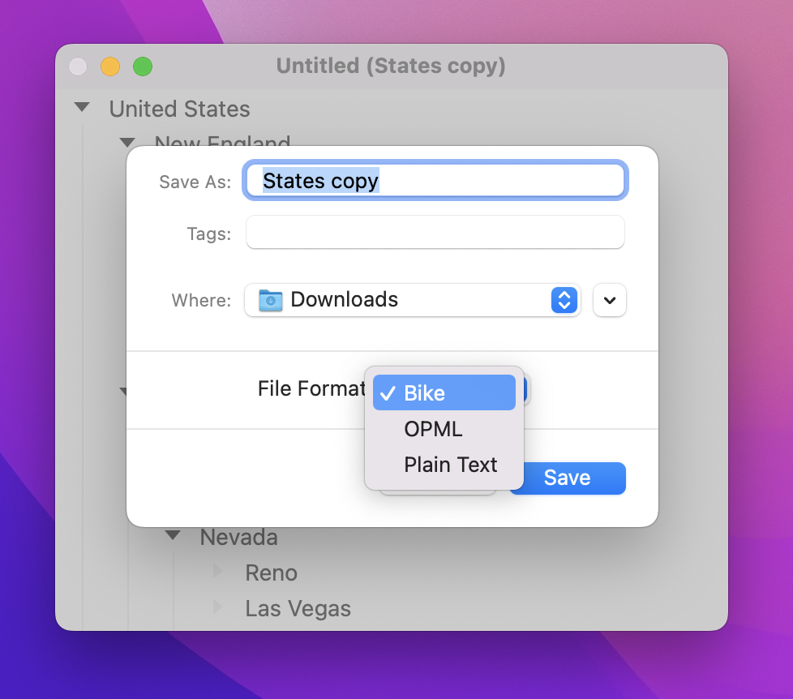

# Using Documents

From macOS User Guide:

* [Open documents](https://support.apple.com/guide/mac-help/open-documents-mchl971293e1/12.0/mac/12.0)
* [Create and work with documents](https://support.apple.com/guide/mac-help/create-and-work-with-documents-mchldc1dd114/12.0/mac/12.0)
* [View and restore past versions of documents](https://support.apple.com/guide/mac-help/view-and-restore-past-versions-of-documents-mh40710/12.0/mac/12.0)

### Own Your Data

Bike is a document based app that uses open file formats.

This combination gives you full ownership of your data. Your notes and thoughts aren't locked behind a proprietary web-service. They aren't hidden away in a database available for [export only](https://twitter.com/andy\_matuschak/status/1452438176996347907).

In Bike your data is fully within your control, stored in normal document files right on your computer. These files use open file formats. Even if you delete Bike from your computer you should still be able to view and edit your outlines.

### Bike Format Options

`.bike`: This is Bike's native format and the one I would recommend using. It supports all Bike features. It is also an HTML document – you can view Bike files in your web browser.

`.opml`: This is a standard format for saving outlines. Use `.opml` if you wish to edit your outline with Bike and another [OPML compatible application](../bike-compatible-apps.md).

`.txt`: Bike can also work with plain text files. The outline structure is determined by the leading tab indentation. Text files don't offer any good place to store metadata (such as item ids). For this reason some features (such as links to rows) will break when you close and then reopen a `.txt` based outline.
