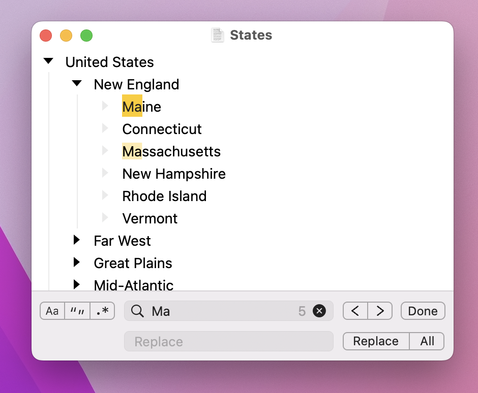

# Using Find Panel

Use the find panel to find text in your outline.

#### To show the find panel

* Use the menu Edit > Find > Find... (`Command-F`)

#### To advance to the next match

* Click the Next button in the find panel
* Or use Edit > Find > Find Next (`Command-G`)

The current match is highlighted brighter then other matches.

#### To go back to the previous match

* Click the Previous button in the find panel
* Or use Edit > Find > Find Previous (`Shift-Command-G`)

#### To replace the current match with the contents of the replace field

* Click the replace button
* Or press the `Return` key when the replace field has keyboard focus

#### To replace all matches

* Click the replace all button. Remember this will only replace all matches in the current focused region of your outline.

#### To hide the find panel

* Click the `Done` button in the find panel
* Or press the `Escape` key

### What is Searched?

Find will search the focused rows of your outline including collapsed rows. Find Next will expand collapsed rows to reveal and select the text that matches.

### Find Panel Options

Find options show to the left of the search text field:

`Aa` - Your search will be case sensitive.

`""` - Your search will match whole words.

`.*` - Your search will be interperted as a [regular expression](https://www.quora.com/What-are-the-best-resources-for-learning-regular-expressions).
