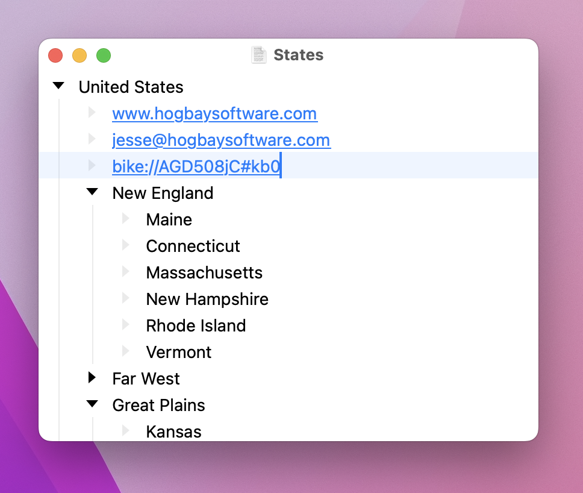

# Using Links



Bike highlights URL and email links as you type.

When you activate a link by clicking on it the link will be opened in the app configured to open that link link type. For example `http` links will open in your web browser.


To activate a link without the mouse place the text caret somewhere in the link. Then show the context menu with the menu item View > Show Context Menu (`Control-M`). Use arrow keys to choose Open Link from that menu.


### Bike Links

Bike includes its own link type that allows you to link directly to an item in your outline.

Bike links are normal URLs. You can paste them into other apps and they'll continue to work as long as Bike is installed on your computer. For example you can paste a Bike link into Apple's Notes app and when you click that link it will open Bike and select the linked to item.

This is a Bike link:

```
bike://dnyzqSRa#Ir
```

Bike links are composed of three parts. The first part, `bike` identifiers the link as a Bike link. The second part, `dnyzqSRa`, is the id of the linked to outline. The third part, `Ir`, is the id of the linked to item. A nice feature of these links is that they won't break when you edit your outline or rename your outline file.

#### To create a Bike link:

* Use the menu Edit > Copy Link `Shift-Command-C` to copy a link to the selected item.

Alternatively you can drag an item by its triangle handle and then hold down the `Control` key before releasing the mouse. A link to the dragged item will be inserted into your outline.

### Bike Path Links

Bike links also have an alternative form. Bike path links use a file path to locate the associated outline file instead of using the outline's id.

This is a Bike path link:

```
bike:///Users/jessegrosjean/Documents/todo.bike#aF
```

Path links are more likely to break then normal Bike links. If you move or rename the linked to outline then the link will break. I generally recommend using normal Bike links.

#### To create a Bike path link:

* Use the menu Edit > Copy Path Link to copy a path link to the selected item.

### What if a link stops working?

Links can "break" for some obvious and non-obvious reasons.

* Create a link to a document and then delete that document. When you activate the link the document won't be found. This is probably not surprising!
* Create a link to an item in a document and then delete that item. When you activate the link the document will be opened, but you'll get a warning that the linked item could not be found.
* Bike uses Spotlight searches to resolve links. It associates the outline id with the document file and then searches for that id using Spotlight. This means if something is going wrong with Spotlight then you are links won't work. This is a temporary problem, they will work again once the document id is again indexed with Spotlight.
* This association between a document file and root id is done by setting the `com.apple.metadata:kMDItemIdentifier` extended file attribute each time Bike saves a file. This means if a file's extended attributes are somehow lost then links to that file will break until next time the file is opened and saved through Bike.
* If you have two outline documents with the same outline id (for example if you duplicate an outline file) then links to that root id will open both documents.
